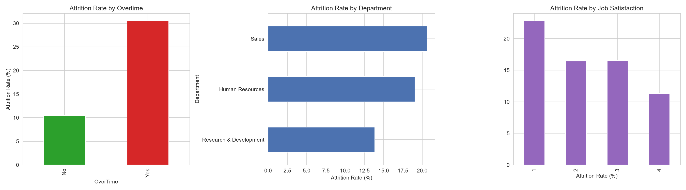
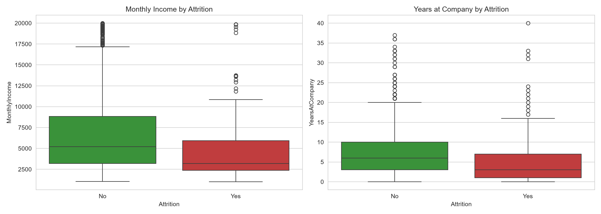
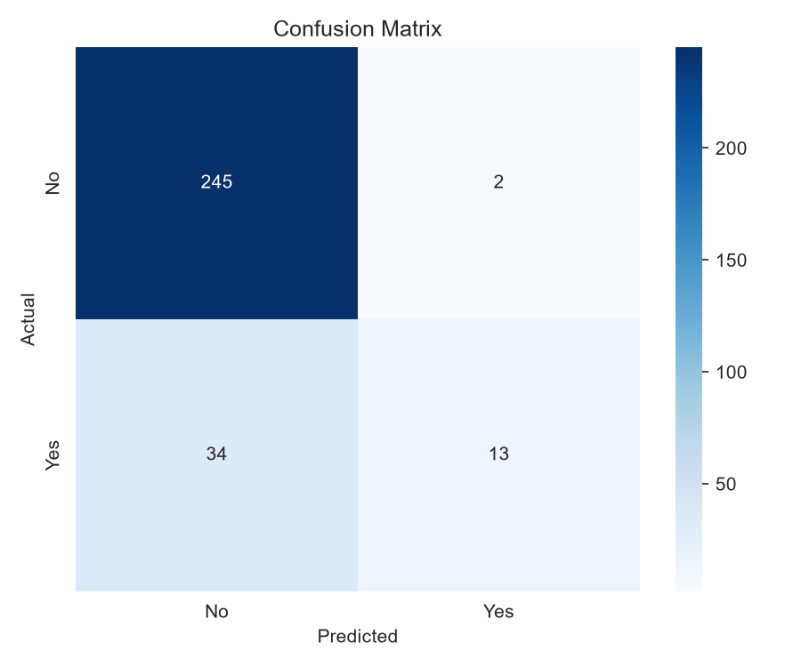
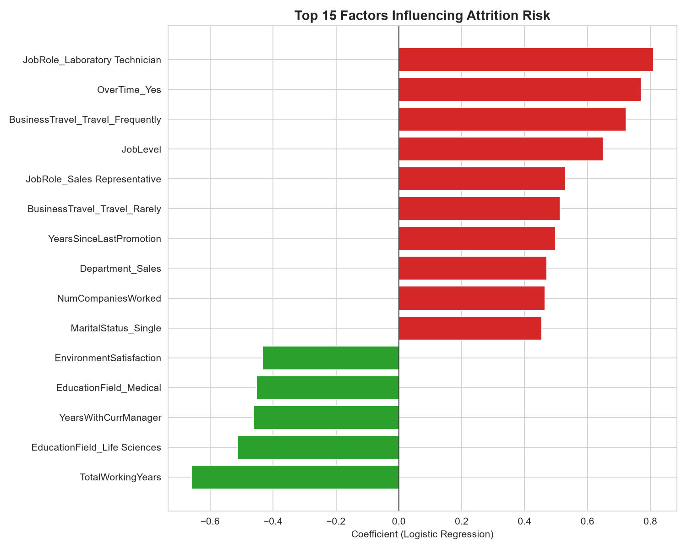

# Employee Attrition Analysis

Analyzing what drives employee attrition using Python — exploratory analysis, visualization, and a logistic regression model to identify at-risk employees and inform retention strategy.

## Executive Summary

This project analyzes IBM's HR Analytics dataset (1,470 employees, 16.1% attrition rate) to identify the strongest drivers of employee turnover. Exploratory analysis reveals overtime, sales roles, and promotion stagnation as major risk factors. A logistic regression model was built to predict attrition risk, with explicit attention to a common but important pitfall: class imbalance. A baseline model achieved 87.8% accuracy but caught only 28% of employees who actually left — essentially useless for a real retention use case. After rebalancing, the model traded overall accuracy for substantially better recall (62%), correctly identifying far more at-risk employees — a deliberate, business-driven trade-off discussed in detail below.

## Tech Stack
- Python (pandas, scikit-learn, matplotlib, seaborn)
- Logistic Regression (classification)
- Jupyter Notebook

## Dataset
[IBM HR Analytics Employee Attrition & Performance](https://www.kaggle.com/datasets/pavansubhasht/ibm-hr-analytics-attrition-dataset) — a fictional but realistic dataset created by IBM data scientists, covering 1,470 employees across 35 attributes (demographics, compensation, job role, satisfaction scores, tenure, etc.).

## Project Structure

├── data/ # dataset + source documentation
├── notebooks/ # full analysis and modeling notebook
├── images/ # exported charts
└── README.md

## Approach

**1. Exploratory analysis** — examined attrition rates across overtime status, department, job satisfaction, income, and tenure to identify initial patterns.

**2. Data preparation for modeling** — dropped non-predictive columns (constant values, employee ID), encoded categorical variables via one-hot encoding, and scaled numeric features.

**3. Baseline model** — fit a logistic regression model and evaluated using accuracy, precision, recall, and F1-score (not just accuracy, given the class imbalance).

**4. Addressing class imbalance** — applied feature scaling and `class_weight='balanced'` to explicitly address the fact that only ~16% of employees in the dataset actually left, which biased the baseline model toward predicting "stayed" for nearly everyone.

**5. Feature importance** — examined model coefficients to identify which factors most strongly increase or decrease attrition risk.

## Key Findings

**1. Overtime is the single strongest behavioral predictor.** Employees working overtime leave at nearly 3x the rate of those who don't (30.5% vs. 10.4%).

**2. Sales has the highest departmental attrition (20.6%)**, followed by HR (19.0%), with R&D notably lower (13.8%).

**3. Employees who leave earn substantially less** — average monthly income of $4,787 vs. $6,833 for those who stayed (a ~30% gap) — and have shorter average tenure (5.1 years vs. 7.4 years).

**4. Model accuracy is misleading with imbalanced data.** A baseline logistic regression achieved 87.8% accuracy but only caught 28% of employees who actually left — it was effectively guessing "stayed" for almost everyone. After rebalancing (feature scaling + `class_weight='balanced'`), accuracy dropped to 75.2%, but recall for actual leavers rose to 62% — a deliberate trade-off, since for a retention use case, catching more at-risk employees matters more than a misleadingly high accuracy score.

**5. Top risk factors identified by the model:**
   - Working in a **Laboratory Technician** or **Sales Representative** role
   - **Overtime**
   - **Frequent business travel**
   - **Longer time since last promotion** (career stagnation)
   - **More companies worked previously** (job-hopping history)
   - **Being single** (fewer local ties)

**6. Top protective factors:**
   - **More total working years** (career-stage stability)
   - **Longer tenure with current manager** (consistent with "people leave managers, not companies")
   - **Higher environment satisfaction**
   - **Life Sciences / Medical education background**

## Visualizations

### Attrition by Overtime, Department, and Job Satisfaction

### Monthly Income and Tenure by Attrition

### Model Confusion Matrix

### Top Factors Influencing Attrition Risk

## Recommendations

1. **Address overtime culture, especially in high-risk roles.** With nearly 3x higher attrition among overtime workers, auditing workload distribution — particularly for Lab Technicians and Sales Representatives — could meaningfully reduce turnover.

2. **Review Sales department retention specifically.** Highest departmental attrition combined with Sales Representative being a top individual risk factor suggests role-specific issues (commission structure, travel burden, or job-hopping culture in sales) worth investigating directly with exit interviews.

3. **Create clearer promotion pathways.** Longer time since last promotion is a meaningful risk factor — regular career conversations and transparent promotion criteria could reduce stagnation-driven departures.

4. **Prioritize manager relationship stability.** Since tenure with current manager is protective, minimizing unnecessary manager reassignments and investing in manager training could support retention.

5. **Use the model as an early-warning tool, not a verdict.** Given the recall/precision trade-off, this model is best used to flag employees for a supportive check-in conversation — not as a definitive prediction. A false positive (flagging someone who wasn't going to leave) costs little; a false negative (missing someone who does leave) costs a lot more.

## Honest Limitations

- **Synthetic dataset:** This is IBM's well-known fictional dataset, not real company data — patterns are realistic but should be validated against real organizational data before acting on them directly.
- **Model trade-off:** The rebalanced model prioritizes recall over precision — in practice, this means more false alarms (employees flagged as at-risk who don't leave) in exchange for catching more true departures. This trade-off should be explicitly chosen based on organizational cost tolerance.
- **Correlation, not causation:** These are associations, not proven causal drivers — e.g., overtime and attrition may both stem from a third factor (understaffing) rather than overtime directly causing departure.

## Setup / How to Run
1. Clone this repo
2. Install dependencies: `pip install pandas matplotlib seaborn scikit-learn`
3. Open `notebooks/attrition_analysis.ipynb` and run all cells